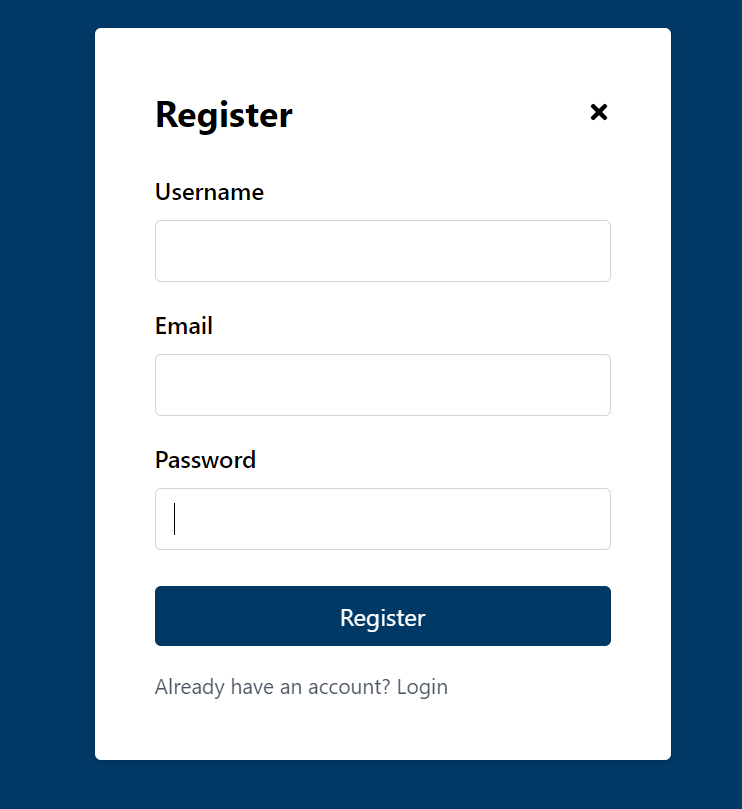
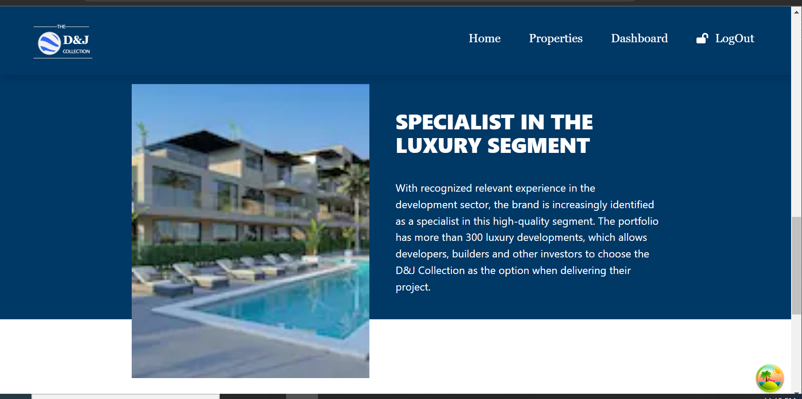
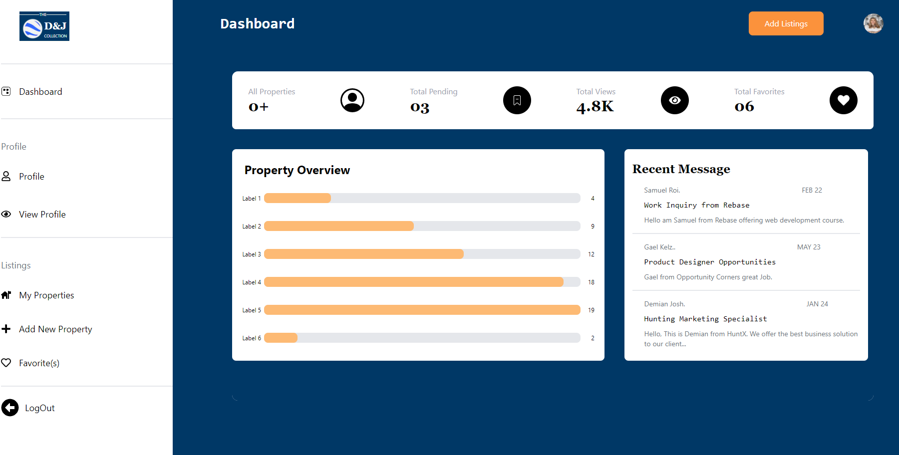
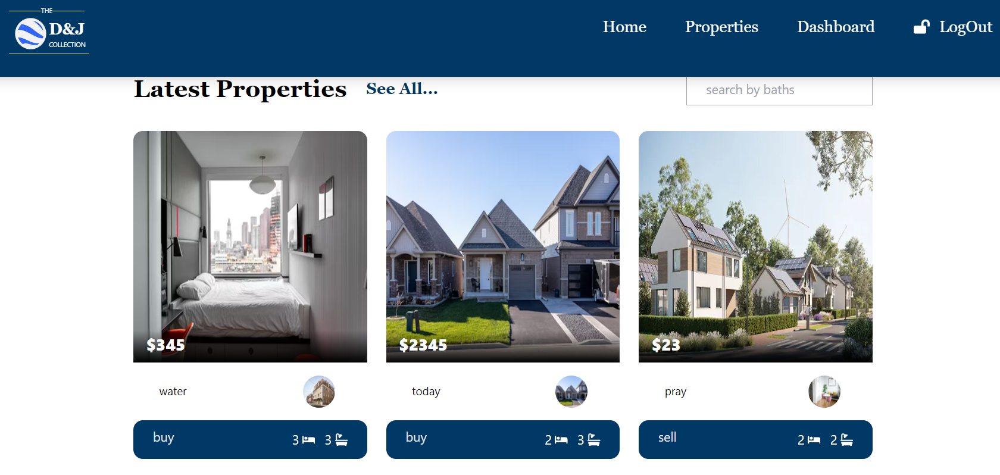
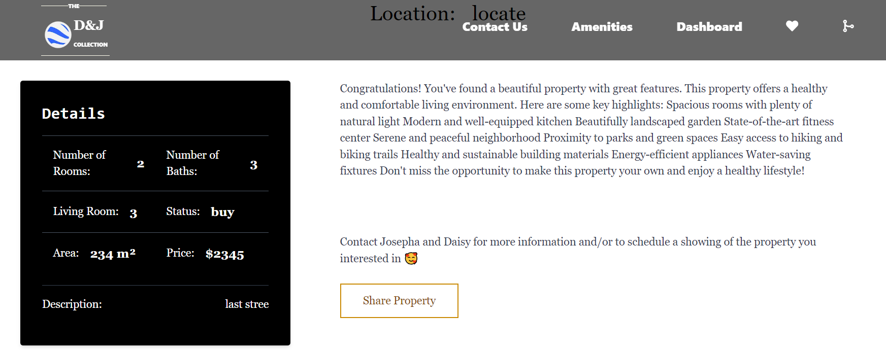

# D&G Collection
The D&G Collection is a real estate project that allows users to perform CRUD (Create, Read, Update, Delete) operations on property listings. It has both a front-end.
## Features
1 User authentication(Login/registration)
2 Create new property listings
3 View a list of all available properties
4 Update existing property details
5 Delete property listings
6 Search and filter properties by various criteria (location, price, size, etc.)
## Technologies Used
Front-end: Next.js, CSS, Tailwind 
Authentication: JSON Web Tokens (JWT)
## Screen Shots
Here are some screenchots of the project
## Login and Registration

## Luxury Segment

## Dashboard

## Cards

## Details Page


### START APP

- To start application, run
    ```bash
        $ npm run dev # to start development server
    ```

- [live deployment](https://dandj-collection.vercel.app/)